# AI-Native IDE — Architecture Notes

> _Technical mapping of the existing Roo Code extension architecture, privilege separation model, sidecar data model specification, and identification of governance hook insertion points._

**Version**: 1.3.0 | **Authored**: 2026-02-17 | **Updated**: 2026-02-18

---

## Table of Contents

0. [Foundation](#0-foundation)
1. [Current Extension Architecture Overview](#1-current-extension-architecture-overview)
2. [Tool Execution Loop Mapping](#2-tool-execution-loop-mapping)
3. [LLM Request/Response Lifecycle](#3-llm-requestresponse-lifecycle)
4. [System Prompt Construction Pipeline](#4-system-prompt-construction-pipeline)
5. [Identified Interception Points](#5-identified-interception-points)
6. [Privilege Separation & Hook Middleware Boundary](#6-privilege-separation--hook-middleware-boundary)
7. [Sidecar Data Model (`.orchestration/`)](#7-sidecar-data-model-orchestration)
8. [Three-State Execution Flow](#8-three-state-execution-flow)
9. [Concurrency & Safety Injection Points](#9-concurrency--safety-injection-points)
10. [Multi-Agent Concurrency & Conflict Resolution](#10-multi-agent-concurrency--conflict-resolution)
11. [Enterprise Guardrails & Safety](#11-enterprise-guardrails--safety)
12. [Appendix A: File Reference Map](#appendix-a-file-reference-map)
13. [Appendix B: Modification Impact Summary](#appendix-b-modification-impact-summary)

---

## 0. Foundation

### **Roo Code Extension for Visual Studio Code**

Roo Code is an open-source, AI-powered coding assistant built as an extension for Visual Studio Code. It integrates large language models directly into the editor, effectively acting like an AI-powered development team inside the IDE.

With Roo Code, developers can issue plain-English requests through a sidebar panel to generate code, refactor existing files, write documentation, run tests, and more. Key capabilities include multi-file editing, automated debugging, and context-aware Q\&A about the codebase. As an open-source tool, Roo Code is free to use, and costs only arise from external LLM API usage if cloud providers are selected.

#### **Features**

##### **Natural-language code generation**

Roo Code can produce new code from plain-English descriptions or specifications. For example, a request such as “create a REST API endpoint in Python” results in generated implementation code. It works across multiple files and understands project context.

##### **Refactoring and debugging**

It can modify or refactor existing code across multiple files, not just provide inline suggestions. Roo Code can trace issues, suggest debug logs, and help isolate root causes. This behavior is agent-like and goes beyond traditional autocomplete tools.

##### **Documentation and Q\&A**

The extension can write or update documentation and answer questions about the code. Developers can ask it to explain how a function works or summarize a module, using the full context of the repository.

##### **Multiple modes**

Roo Code provides specialized modes tailored to different tasks:

- Code Mode for everyday coding, edits, and file operations
- Ask Mode for quick Q\&A, explanations, and documentation writing
- Architect Mode for high-level planning, system design, and specifications
- Debug Mode for identifying bugs, adding logs, and isolating errors
- Custom Modes that teams can define for specific workflows
- Roomote Control for managing local VS Code tasks remotely

Switching modes changes Roo Code’s behavior and tool usage, keeping context aligned with the task.

##### **Automation and tools**

Beyond editing text, Roo Code can automate repetitive tasks and invoke tools. It can run terminal commands such as npm install or test suites and can open a browser for integration testing, always requiring user approval.

It integrates with external tools through its Model Context Protocol, enabling connections to databases, APIs, or custom scripts when needed.

##### **Model-agnostic and multi-language**

Roo Code works with a wide range of LLM providers, including:

- OpenAI models such as GPT-4o and GPT-4
- Anthropic models such as Claude
- Google Gemini models
- Local or self-hosted LLMs like Ollama based

It supports many programming languages including Python, Java, C\#, JavaScript, TypeScript, Go, and Rust, depending on the underlying model capabilities.

##### **Privacy and control**

Because Roo Code runs as a local VS Code extension, code remains on the machine unless explicitly sent to a cloud model. All proposed file changes and command executions require user approval before execution.

Sensitive files can be excluded using a .rooignore file. Teams can also use fully local models for maximum privacy and compliance.

### Governance

The extension's operations are governed by a hierarchy of documents:

- **System Constitution** (`.specify/memory/constitution.md`): The supreme law defining invariants and governance axioms. No architectural decision or code mutation may violate the Constitution.
- **System Soul** (`.specify/memory/soul.md`): The philosophical character and behavioral specifications of system agents. It defines _how_ agents should reason (e.g., Spec-Driven Reasoning).
- **Architecture Notes** (This document): The technical blueprint mapping governance onto the physical codebase.

---

## 1. Current Extension Architecture Overview

### 1.1 High-Level Component Map (With Privilege Separation)

The extension follows a VS Code Webview Extension architecture with **four distinct privilege domains**. The Hook Engine acts as a strict middleware boundary between the Extension Host's core logic and all mutating operations:


### 1.2 Webview (UI Layer) Responsibilities

**Location:** `webview-ui/src/`

The Webview is a React application rendered inside a VS Code Webview Panel. It is a **pure presentation layer** with no direct access to the filesystem, Node.js APIs, or extension state.

**Responsibilities:**

- Renders the chat interface (user messages, assistant responses, tool use visualizations)
- Presents tool approval dialogs (ask/approve/deny workflow)
- Displays settings, task history, and mode selection
- Sends user actions as typed messages to the Extension Host via `vscode.postMessage()`
- Receives state updates from the Extension Host via `onDidReceiveMessage`

**Communication boundary:**

- All communication is serialized JSON over the VS Code message bridge
- The Webview CANNOT invoke tools, access files, or call LLM APIs directly
- State flows unidirectionally: Extension Host → Webview (state push), Webview → Extension Host (user action messages)

### 1.3 Extension Host Responsibilities

**Location:** `src/`

The Extension Host runs in Node.js within the VS Code process. It owns all business logic, state, and external integrations.

**Key components and their roles:**

| Component                 | Location                                             | Responsibility                                                                                            |
| ------------------------- | ---------------------------------------------------- | --------------------------------------------------------------------------------------------------------- |
| `extension.ts`            | `src/extension.ts`                                   | Entry point. Activates extension, registers commands, creates ClineProvider                               |
| `ClineProvider`           | `src/core/webview/ClineProvider.ts`                  | Webview host. Manages Task lifecycle, routes webview messages, holds `ContextProxy` (settings state)      |
| `Task`                    | `src/core/task/Task.ts`                              | **Core execution engine.** Manages the LLM conversation loop, tool dispatch, message history, checkpoints |
| `ApiHandler`              | `src/api/index.ts`                                   | Abstraction over LLM providers. `buildApiHandler()` factory creates provider-specific handlers            |
| `BaseTool`                | `src/core/tools/BaseTool.ts`                         | Abstract base for all tools. Defines `execute()`, `handlePartial()`, `handle()` lifecycle                 |
| `presentAssistantMessage` | `src/core/assistant-message/`                        | Processes streamed assistant content blocks, dispatches tool invocations, handles approval flow           |
| `NativeToolCallParser`    | `src/core/assistant-message/NativeToolCallParser.ts` | Parses native tool call responses from LLM streaming                                                      |
| `system.ts`               | `src/core/prompts/system.ts`                         | Constructs the system prompt from modular sections                                                        |
| `build-tools.ts`          | `src/core/task/build-tools.ts`                       | Builds the tools array for LLM requests, filtered by mode and experiments                                 |
| `validateToolUse`         | `src/core/tools/validateToolUse.ts`                  | Validates tool names and mode-based permissions at execution time                                         |
| `AutoApprovalHandler`     | `src/core/auto-approval/`                            | Manages automatic approval rules for tool operations                                                      |

### 1.4 Package Architecture

The project uses a monorepo structure with isolated packages:

| Package                 | Location                | Role                                   |
| ----------------------- | ----------------------- | -------------------------------------- |
| `@roo-code/types`       | `packages/types/`       | Shared TypeScript type definitions     |
| `@roo-code/core`        | `packages/core/`        | Core utilities, custom tool registry   |
| `@roo-code/ipc`         | `packages/ipc/`         | Inter-process communication primitives |
| `@roo-code/telemetry`   | `packages/telemetry/`   | Usage telemetry                        |
| `@roo-code/cloud`       | `packages/cloud/`       | Cloud service integration              |
| `@roo-code/vscode-shim` | `packages/vscode-shim/` | VS Code API shim for testing           |

---

## 2. Tool Execution Loop Mapping

### 2.1 Complete Tool Call Lifecycle

The following describes the exact lifecycle of a tool invocation from LLM response to UI feedback:

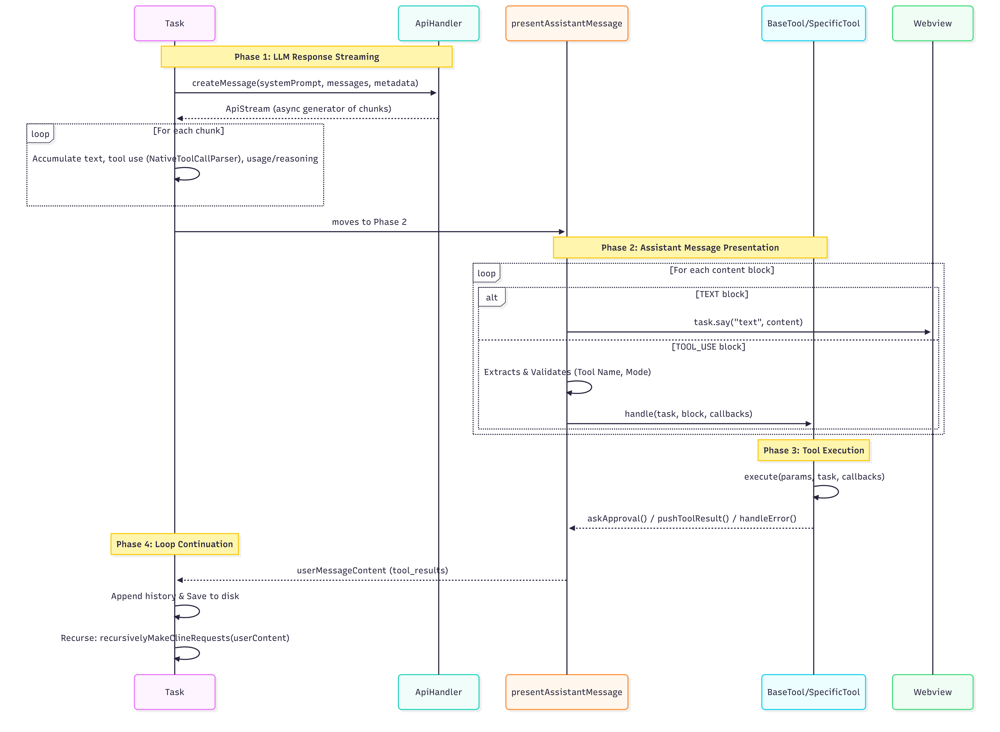

### 2.2 Write Operations: `write_to_file` Flow

**Location:** `src/core/tools/WriteToFileTool.ts`

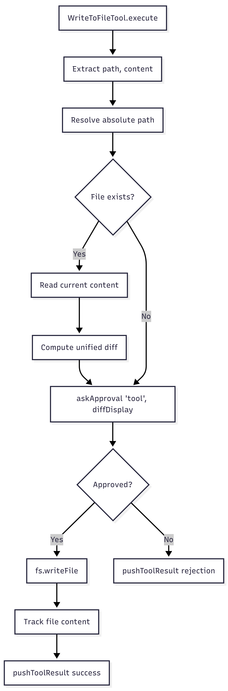

### 2.3 Command Execution: `execute_command` Flow

**Location:** `src/core/tools/ExecuteCommandTool.ts`

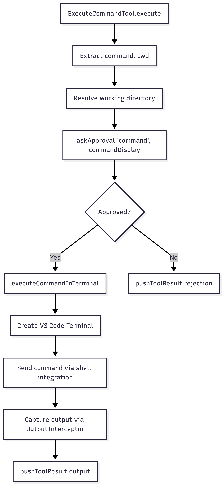

### 2.4 Response Propagation to UI

Tool results propagate back to the Webview through a defined chain:

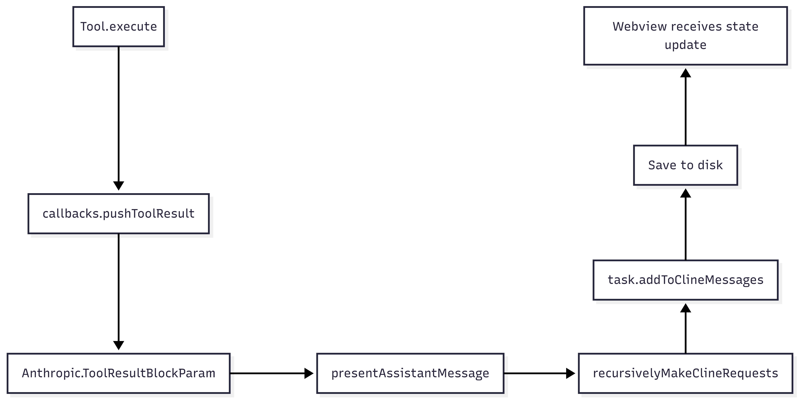

---

## 3. LLM Request/Response Lifecycle

### 3.1 Complete Request Flow

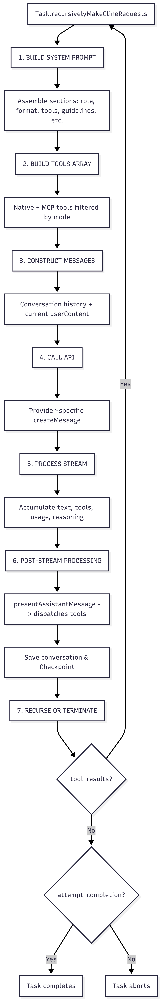

### 3.2 Provider Abstraction

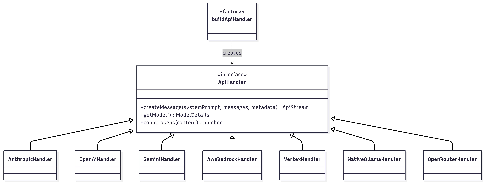

---

## 4. System Prompt Construction Pipeline

### 4.1 Prompt Assembly Chain

**Location:** `src/core/prompts/system.ts`

The system prompt is assembled from modular sections. Each section is a function that returns a string fragment:

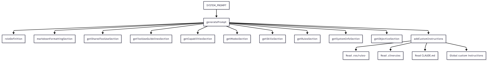

### 4.2 Prompt Section Sources

**Location:** `src/core/prompts/sections/`

| Section File             | Content                                                     |
| ------------------------ | ----------------------------------------------------------- |
| `capabilities.ts`        | Lists environment capabilities (file ops, terminal, MCP)    |
| `custom-instructions.ts` | Loads project-level and global custom instructions          |
| `markdown-formatting.ts` | Output format constraints                                   |
| `modes.ts`               | Available mode descriptions                                 |
| `objective.ts`           | High-level task framing                                     |
| `rules.ts`               | Project rules from `.roo/`, `.clinerules`, protection rules |
| `skills.ts`              | Loaded skills descriptions                                  |
| `system-info.ts`         | OS, shell, working directory, timestamps                    |
| `tool-use.ts`            | Shared tool use section                                     |
| `tool-use-guidelines.ts` | Tool usage guidelines                                       |

### 4.3 Custom Instructions Loading (Critical Integration Point)

**Location:** `src/core/prompts/sections/custom-instructions.ts`

The `addCustomInstructions()` function reads from multiple sources in order:

1. Mode-specific instructions (from `promptComponent`)
2. Global custom instructions (from user settings)
3. Project-level rules:
    - `.roo/rules-{mode}/` files (mode-specific)
    - `.roo/rules/` files (global)
    - `.clinerules` (legacy)
    - `CLAUDE.md` (if present)
4. Language preference
5. RooIgnore instructions
6. Protection settings

**This is the primary injection point for governance prompt modifications.**

---

## 5. Identified Interception Points

### 5.1 Pre-Hook Interception Points

These are locations where governance logic can intercept BEFORE an action occurs:

| ID        | Location                                                         | Intercepts                | Current Flow                                          |
| --------- | ---------------------------------------------------------------- | ------------------------- | ----------------------------------------------------- |
| **PRE-1** | `Task.recursivelyMakeClineRequests()` — before `createMessage()` | LLM requests              | System prompt + messages assembled, about to call API |
| **PRE-2** | `presentAssistantMessage()` — before tool dispatch               | All tool invocations      | Tool name validated, about to call `tool.handle()`    |
| **PRE-3** | `BaseTool.handle()` — before `execute()`                         | Individual tool execution | Params parsed, about to execute                       |
| **PRE-4** | `WriteToFileTool.execute()` — before `fs.writeFile()`            | File write mutations      | Path resolved, diff computed, approval received       |
| **PRE-5** | `ExecuteCommandTool.execute()` — before terminal execution       | Command execution         | Command string known, approval received               |
| **PRE-6** | `SYSTEM_PROMPT()` — during prompt assembly                       | System prompt content     | All sections available, prompt being concatenated     |
| **PRE-7** | `buildNativeToolsArray()` — during tools construction            | Available tools list      | Tools being filtered by mode                          |
| **PRE-8** | `Task.startTask()` — before first LLM call                       | Task initialization       | User message known, about to enter loop               |

### 5.2 Post-Hook Interception Points

These are locations where governance logic can observe AFTER an action completes:

| ID         | Location                                                        | Observes                | Current Flow                         |
| ---------- | --------------------------------------------------------------- | ----------------------- | ------------------------------------ |
| **POST-1** | `Task.recursivelyMakeClineRequests()` — after stream completion | LLM response content    | Full assistant message available     |
| **POST-2** | `presentAssistantMessage()` — after all tools dispatched        | Completed tool results  | All tool_results accumulated         |
| **POST-3** | `BaseTool.handle()` — after `execute()` returns                 | Individual tool outcome | Tool completed or errored            |
| **POST-4** | `WriteToFileTool.execute()` — after `fs.writeFile()`            | File mutation evidence  | File written, path and content known |
| **POST-5** | `ExecuteCommandTool.execute()` — after terminal output          | Command output          | Execution completed, output captured |
| **POST-6** | `Task.addToApiConversationHistory()` — after message saved      | Conversation state      | New message persisted to history     |
| **POST-7** | `Task.saveClineMessages()` — after UI messages saved            | UI message state        | Cline messages persisted             |
| **POST-8** | `Task.abortTask()` / completion                                 | Task lifecycle end      | Task finishing, all state available  |

### 5.3 State Injection Points (Before LLM Calls)

These are locations where orchestration state can be injected into the LLM context:

| ID        | Location                              | Injection Target       | Mechanism                                              |
| --------- | ------------------------------------- | ---------------------- | ------------------------------------------------------ |
| **INJ-1** | `addCustomInstructions()`             | System prompt          | Append governance rules as custom instructions         |
| **INJ-2** | `generatePrompt()`                    | System prompt sections | Add new governance section alongside existing sections |
| **INJ-3** | `Task.recursivelyMakeClineRequests()` | User message content   | Prepend governance context to `userContent[]`          |
| **INJ-4** | `buildNativeToolsArray()`             | Tools definition       | Add/modify/restrict tools based on active intent       |
| **INJ-5** | `Task.startTask()`                    | Initial message        | Inject intent selection requirement into first message |

---

## 6. Privilege Separation & Hook Middleware Boundary

### 6.1 Three-Domain Privilege Separation

The physical architecture is designed with **strict privilege separation** across three domains:

| Domain                       | Privilege Level            | Capabilities                                                                             | Cannot Do                                                      |
| ---------------------------- | -------------------------- | ---------------------------------------------------------------------------------------- | -------------------------------------------------------------- |
| **Webview (UI)**             | Restricted presentation    | Render UI, emit events via `postMessage`                                                 | Access filesystem, invoke tools, call LLM APIs, read secrets   |
| **Extension Host (Logic)**   | Core runtime               | API polling, secret management, MCP tool execution, LLM calls                            | Mutate files without Hook Engine approval, bypass scope checks |
| **Hook Engine (Governance)** | Strict middleware boundary | Intercept all tool execution, enforce HITL authorization, manage `.orchestration/` state | Modify core logic, access Webview directly                     |

The Hook Engine is the **only** component permitted to read/write the `.orchestration/` sidecar directory. All tool execution requests MUST pass through the Hook Engine before reaching the filesystem, terminal, or external services.

### 6.2 Hook Engine Architecture

The Hook Engine SHALL be implemented as a middleware layer that wraps existing execution flows without modifying core logic. It operates at two interception phases:

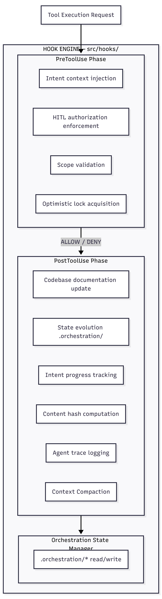

**Hook Engine responsibilities:**

- Intercept ALL tool execution requests before they reach the filesystem/terminal
- **PreToolUse:** Enforce intent context injection, **Context Compaction (PreCompact)**, and Human-in-the-Loop (HITL) authorization (**PreAuthorize**).
- **PostToolUse:** Update codebase documentation, state evolution, and intent changes.
- **Guardrails:** Monitor **Execution Budgets** and trigger **Circuit Breakers** for infinite loops or privilege escalation.
- Manage the `.orchestration/` sidecar directory as the sole writer.
- Provide typed interfaces for hook implementations.

**Hook interface contract (conceptual):**

```
HookContext {
  operation:     OperationType        // "tool_execute", "llm_request", "file_write", ...
  agentId:       string               // Active agent identity
  intentId:      string | undefined   // Active intent (if declared)
  targetPath:    string | undefined   // File path being operated on
  toolName:      string | undefined   // Tool being invoked
  timestamp:     number               // Operation timestamp
  vcs:           { revision_id: string } // Current git SHA
  metadata:      Record<string, any>  // Operation-specific data
}

PreHookResult {
  allow:         boolean              // Whether to proceed
  reason:        string | undefined   // Denial reason (for logging)
  injectedContext: string | undefined // Deep context to inject into prompt
  modifiedContext: Partial<HookContext> // Optional context modifications
}

PostHookInput {
  context:       HookContext           // Original operation context
  result:        OperationResult       // Outcome of the operation
  contentHash:   string | undefined    // SHA-256 of modified content block
  duration:      number                // Execution duration
}
```

### 6.3 Isolation Strategy: `src/hooks/`

**Location:** `src/hooks/` (currently empty — reserved for governance)

The hooks directory SHALL contain all governance logic, fully isolated from core extension code. The isolation boundary is strict:

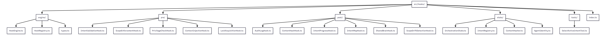

### 6.4 How Core Logic Remains Untouched

The integration strategy follows the **Decorator Pattern** — core functions are wrapped with hook calls at their boundaries, not modified internally:

**Principle:** No governance logic SHALL exist inside `src/core/`, `src/api/`, or `src/services/`. All governance logic lives in `src/hooks/`. Core code receives minimal instrumentation: a single call to the Hook Engine at each identified interception point.

**Instrumentation pattern (conceptual flow, not code):**

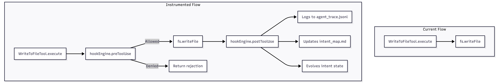

**Changes to core files are limited to:**

1. Importing the Hook Engine
2. Adding `hookEngine.preToolUse()` calls before operations
3. Adding `hookEngine.postToolUse()` calls after operations
4. Core logic flow, error handling, and data structures remain unchanged

---

## 7. Sidecar Data Model (`.orchestration/`)

The governance system uses a **Sidecar Storage Pattern** in `.orchestration/`. These files are **machine-managed** — created, read, and updated exclusively by the Hook Engine. Human developers may read them for debugging but SHOULD NOT edit them directly.

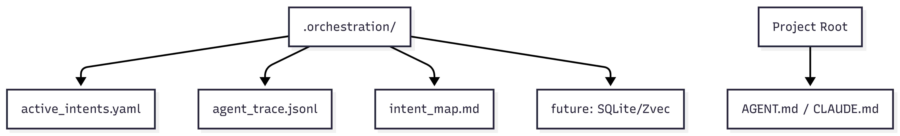

> **Storage Evolution Note:** The initial implementation uses flat files (YAML, JSONL, Markdown). Based on performance requirements and architecture capability, the storage MAY evolve to a high-performance local database (SQLite, Zvec, or similar). The Hook Engine's `OrchestrationState` manager abstracts the storage backend to enable this migration without upstream changes.

### 7.1 `active_intents.yaml` — The Intent Specification

**Purpose:** Tracks the lifecycle of business requirements. Inspired by Spec-Driven Development and AISpec, this file treats the codebase as a collection of formalized intents. Not all code changes are equal — this file tracks _why_ we are working.

**Update Pattern:** Updated via Pre-Hooks (when an agent picks a task) and Post-Hooks (when a task is complete).

**Schema:**

```yaml
active_intents:
    - id: "INT-001"
      name: "JWT Authentication Migration"
      status: "IN_PROGRESS" # PENDING | IN_PROGRESS | BLOCKED | COMPLETED | ABANDONED
      # Formal Scope Definition (Crucial for Parallelism)
      owned_scope:
          - "src/auth/**"
          - "src/middleware/jwt.ts"
      constraints:
          - "Must not use external auth providers"
          - "Must maintain backward compatibility with Basic Auth"
      # The "Definition of Done"
      acceptance_criteria:
          - "Unit tests in tests/auth/ pass"
          - "Integration tests verify backward compatibility"
      # Agent assignment
      assigned_agent: "agent-builder-01"
      # Traceability
      related_specs:
          - type: "specification"
            value: "REQ-001"
      created_at: "2026-02-16T12:00:00Z"
      updated_at: "2026-02-17T15:30:00Z"
```

**When `active_intents.yaml` Is Read:**

| Trigger                    | Location                                        | Purpose                                                                               |
| -------------------------- | ----------------------------------------------- | ------------------------------------------------------------------------------------- |
| **Task start**             | `Task.startTask()`                              | Load active intents. Determine if agent must `select_active_intent` before proceeding |
| **Reasoning Intercept**    | `select_active_intent` Pre-Hook                 | Query constraints, related files, and recent history for the selected intent          |
| **Before each LLM call**   | `Task.recursivelyMakeClineRequests()` via PRE-1 | Verify active intent is still valid. Load scope constraints for prompt injection      |
| **Before tool execution**  | `presentAssistantMessage()` via PRE-2           | Resolve `owned_scope` boundaries. Validate tool target is within scope                |
| **On intent state change** | Hook Engine state management                    | When an intent transitions lifecycle state (IN_PROGRESS → COMPLETED, etc.)            |

**Read strategy:** The file SHALL be read lazily and cached within the Hook Engine's `OrchestrationState` manager. Cache invalidation occurs on file change (via VS Code `FileSystemWatcher`) or on explicit state transition.

### 7.2 `agent_trace.jsonl` — The Ledger

**Purpose:** An append-only, machine-readable history of every mutating action, linking the abstract **Intent** to the concrete **Code Hash**. This is the system's audit trail and the foundation for intent-code traceability.

**Update Pattern:** Updated via Post-Hook after file writes and other mutating operations.

**Full Agent Trace Specification (with Spatial Independence via Content Hashing):**

```json
{
	"id": "uuid-v4",
	"timestamp": "2026-02-16T12:00:00Z",
	"event_type": "file_mutation",
	"vcs": {
		"revision_id": "git_sha_hash"
	},
	"files": [
		{
			"relative_path": "src/auth/middleware.ts",
			"conversations": [
				{
					"url": "session_log_id",
					"contributor": {
						"entity_type": "AI",
						"model_identifier": "claude-3-5-sonnet"
					},
					"ranges": [
						{
							"start_line": 15,
							"end_line": 45,
							"content_hash": "sha256:a8f5f167f44f4964e6c998dee827110c"
						}
					],
					"related": [
						{
							"type": "specification",
							"value": "REQ-001"
						},
						{
							"type": "intent",
							"value": "INT-001"
						}
					]
				}
			]
		}
	]
}
```

**Critical Design Properties:**

- **Spatial Independence via Content Hashing:** The `content_hash` (SHA-256) is computed over the **modified code block content**, not the line numbers. If lines move due to upstream edits, the hash remains valid. This decouples the trace from positional instability.
- **The Golden Thread to SpecKit:** The `related[]` array links each code mutation back to specification requirements (`REQ-*`) and intents (`INT-*`), creating a traceable chain from business requirement → intent → code change.
- **Contributor Attribution:** Every trace records whether the change was made by an AI agent (with model identifier) or a human, enabling provenance tracking.

**When `agent_trace.jsonl` Is Written:**

| Event                    | Trigger Location                  | Trace Contents                                                         |
| ------------------------ | --------------------------------- | ---------------------------------------------------------------------- |
| **Intent declared**      | Hook Engine (intent registration) | Intent ID, scope, agent ID, timestamp                                  |
| **Intent activated**     | `select_active_intent` Pre-Hook   | Intent ID, injected context summary, validation result                 |
| **File mutated**         | POST-4 (after WriteToFileTool)    | Full trace record with `files[].conversations[].ranges[].content_hash` |
| **Command executed**     | POST-5 (after ExecuteCommandTool) | Command, exit code, output hash, intent ID                             |
| **LLM request sent**     | POST-1 (after stream completion)  | Provider, model, token usage, intent ID, response hash                 |
| **Intent completed**     | Hook Engine (intent lifecycle)    | Intent ID, completion status, acceptance_criteria results              |
| **Governance violation** | Any pre-hook denial               | Violation type, denied operation, agent ID, intent ID                  |

**Write strategy:** Append-only. Each line is a self-contained JSON object. The file SHALL NOT be truncated or edited during normal operation.

### 7.3 `intent_map.md` — The Spatial Map

**Purpose:** Maps high-level business intents to physical files and AST nodes. When a stakeholder asks, "Where is the billing logic?" or "What intent touched the auth middleware?", this file provides the answer.

**Update Pattern:** Incrementally updated by the `IntentMapHook` Post-Hook when `INTENT_EVOLUTION` occurs — specifically when files are mutated under an active intent, or when an intent's `owned_scope` changes.

**Schema (Markdown for human readability, machine-parseable):**

```markdown
# Intent Map

## INT-001: JWT Authentication Migration

- **Status:** IN_PROGRESS
- **Owned Scope:** `src/auth/**`, `src/middleware/jwt.ts`
- **Files Touched:**
    - `src/auth/middleware.ts` (L15-45, hash: sha256:a8f5...)
    - `src/auth/jwt-provider.ts` (L1-120, hash: sha256:b3c2...)
    - `src/middleware/jwt.ts` (L30-55, hash: sha256:d4e1...)
- **Related Specs:** REQ-001
- **Last Updated:** 2026-02-17T15:30:00Z

## INT-002: Rate Limiting Implementation

- **Status:** PENDING
- **Owned Scope:** `src/middleware/rate-limit/**`
- **Files Touched:** (none yet)
- **Related Specs:** REQ-005
```

### 7.4 `AGENT.md` / `CLAUDE.md` — The Shared Brain

**Purpose:** A persistent knowledge base shared across parallel agent sessions (Architect, Builder, Tester). Contains "Lessons Learned," project-specific stylistic rules, and architectural decisions. This is how parallel agents maintain shared consciousness without explicit coordination.

**Update Pattern:** Incrementally appended by the `SharedBrainHook` Post-Hook when:

| Trigger                           | What Is Appended                                                          |
| --------------------------------- | ------------------------------------------------------------------------- |
| **Verification loop fails**       | Lesson learned: what was tried, why it failed, what worked instead        |
| **Architectural decision made**   | Decision record: context, options considered, decision, rationale         |
| **Governance violation resolved** | Pattern to avoid: what triggered the violation, how to prevent recurrence |
| **Scope conflict detected**       | Coordination note: which intents conflicted, how it was resolved          |

**Strategy note:** Rather than modifying `CLAUDE.md` on disk for every LLM call, the governance layer SHALL:

1. **Read** `AGENT.md`/`CLAUDE.md` from disk as a base knowledge source
2. **Inject** governance-specific context (active intent constraints, scope boundaries) dynamically through the `addCustomInstructions()` pipeline at INJ-1
3. **Append** to `AGENT.md`/`CLAUDE.md` on disk only for durable cross-session knowledge (lessons learned, decisions)

This preserves the original file content for human readability while allowing per-request governance instructions to be computed dynamically based on current orchestration state.

---

## 8. Three-State Execution Flow

The agent is **not allowed to write code immediately**. It must first "checkout" an intent. Every turn of the conversation follows a mandatory Three-State Execution Flow:

### 8.1 The Three States

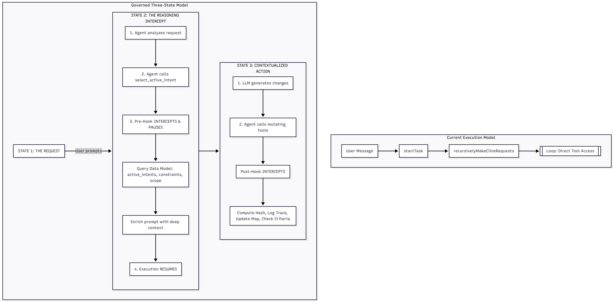

### 8.2 State Transition Mechanics

**State 1 → State 2 (Request → Reasoning Intercept):**

The governance layer forces the agent into the Reasoning Intercept by controlling the system prompt and tool availability:

1. **System prompt injection (INJ-2):** A governance section is prepended to the system prompt:

    - "You MUST call `select_active_intent` before performing any other action"
    - "Any tool call other than `select_active_intent` will be rejected"
    - Lists available intents from `active_intents.yaml` with their names, constraints, and owned_scope

2. **Tool restriction (INJ-4):** The `buildNativeToolsArray()` output is filtered by the Hook Engine to expose ONLY `select_active_intent` until an intent is active. All other tools are removed from the tools array sent to the LLM.

3. **Pre-hook enforcement (PRE-2):** Even if the LLM attempts to call a non-intent-selection tool, the pre-hook at `presentAssistantMessage()` rejects it and returns a `tool_error` explaining that intent must be selected first.

**State 2 → State 3 (Reasoning Intercept → Contextualized Action):**

The critical "pause → enrich → resume" flow:

1. Agent calls `select_active_intent(intent_id: "INT-001")`
2. Pre-Hook **pauses** the execution loop at PRE-2
3. Pre-Hook queries the Data Model:
    - Reads `active_intents.yaml` for INT-001's `constraints`, `owned_scope`, `acceptance_criteria`
    - Reads `agent_trace.jsonl` for recent history of INT-001 (what was already done)
    - Reads `intent_map.md` for current file mappings
    - Reads `AGENT.md`/`CLAUDE.md` for relevant lessons learned
4. Pre-Hook **injects** this deep context into the tool result that flows back to the LLM
5. Pre-Hook **transitions** the Hook Engine state: intent is now active
6. Execution **resumes**: on next `recursivelyMakeClineRequests()` iteration, the full tool set is restored (filtered by `owned_scope`)
7. The system prompt governance section updates to reflect the active intent and its scope boundaries
8. All subsequent tool calls pass through scope validation pre-hooks

### 8.3 State 3: PostToolUse Mechanics

During Contextualized Action, every mutating tool call triggers PostToolUse processing:

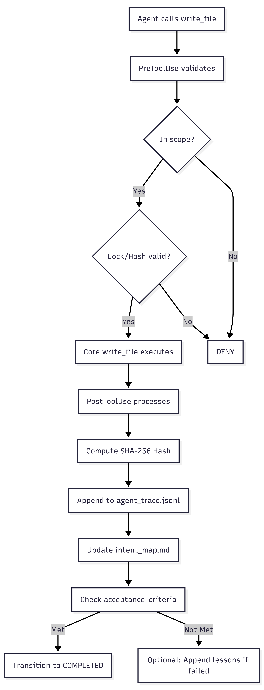

---

## 9. Concurrency & Safety Injection Points

### 9.1 Where Optimistic Locking Will Be Enforced

Optimistic locking prevents concurrent agents from silently overwriting each other's changes:

| Resource               | Lock Granularity | Enforcement Point                     | Mechanism                                                                                  |
| ---------------------- | ---------------- | ------------------------------------- | ------------------------------------------------------------------------------------------ |
| **Files (write)**      | Per-file path    | PRE-4 (before `fs.writeFile`)         | Content hash comparison: read hash at lock acquisition, verify hash unchanged before write |
| **Files (edit)**       | Per-file path    | PRE-3 (before `EditFileTool.execute`) | Same content hash mechanism                                                                |
| **Intent state**       | Per-intent ID    | Hook Engine `OrchestrationState`      | YAML file atomic read-modify-write with version counter                                    |
| **Orchestration YAML** | Whole file       | Hook Engine state manager             | File-level lock with version field in YAML                                                 |
| **Terminal commands**  | Per-terminal ID  | PRE-5 (before terminal execution)     | Terminal ID reservation in orchestration state                                             |

**Optimistic locking flow:**

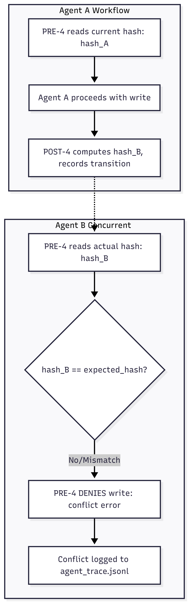

### 9.2 Where Scope Validation Will Occur

Scope validation ensures agents only operate within their declared intent boundaries:

| Validation Point    | Location                                                                       | What Is Checked                                        |
| ------------------- | ------------------------------------------------------------------------------ | ------------------------------------------------------ |
| **File write path** | PRE-4 (`WriteToFileTool`)                                                      | Target path ∈ active intent's scope set                |
| **File edit path**  | PRE-3 (`EditFileTool`, `ApplyDiffTool`, `SearchReplaceTool`, `ApplyPatchTool`) | Target path ∈ active intent's scope set                |
| **File read path**  | PRE-3 (`ReadFileTool`)                                                         | Optional: warn if reading outside scope (non-blocking) |
| **Command CWD**     | PRE-5 (`ExecuteCommandTool`)                                                   | Working directory ∈ active intent's scope set          |
| **File list path**  | PRE-3 (`ListFilesTool`)                                                        | Optional: scoped directory listing                     |
| **LLM request**     | PRE-1                                                                          | Intent ID present in metadata. Scope still valid       |
| **MCP tool call**   | PRE-3 (`UseMcpToolTool`)                                                       | MCP operation target ∈ active intent's scope set       |

**Scope validation flow:**

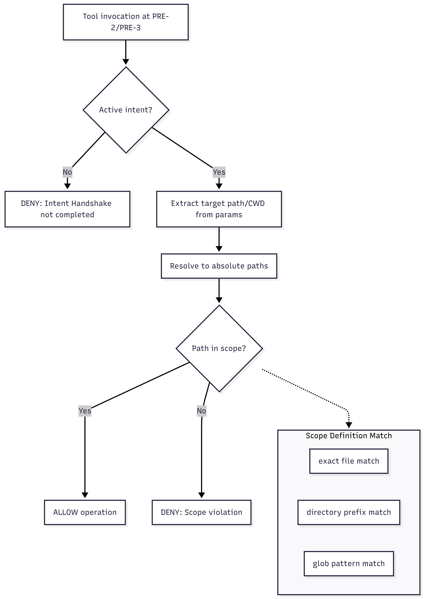

### 9.3 Existing Safety Mechanisms (Preserved)

The current codebase already has safety mechanisms that governance hooks will complement, not replace:

| Mechanism             | Location                            | Function                          | Governance Relationship                                                  |
| --------------------- | ----------------------------------- | --------------------------------- | ------------------------------------------------------------------------ |
| `validateToolUse()`   | `src/core/tools/validateToolUse.ts` | Mode-based tool permission        | Preserved. Governance adds intent-based permission on top                |
| `askApproval()`       | Tool callbacks                      | Human approval for mutations      | Preserved. Governance pre-validates before approval is even requested    |
| `AutoApprovalHandler` | `src/core/auto-approval/`           | Automatic approval rules          | Preserved. Auto-approval only fires if governance pre-hooks allow        |
| `ProtectTool`         | `src/core/protect/`                 | File protection patterns          | Preserved. Governance scope is an additional layer above file protection |
| `RooIgnore`           | `src/core/ignore/`                  | .gitignore-style file exclusion   | Preserved. Governance scope is additive to ignore rules                  |
| Checkpoint system     | `src/core/checkpoints/`             | File state snapshots for rollback | Essential for governance rollback on partial failures                    |

---

## 10. Multi-Agent Concurrency & Conflict Resolution

As the system evolves toward a **Hive Mind** model, concurrency management moves beyond simple file locks to hierarchical orchestration.

### 10.1 Hierarchical Orchestration (Supervisor Pattern)

Complex tasks are handled via a hierarchy:

- **Supervisor Agent:** Maintains the high-level intent (`active_intents.yaml`), decomposes tasks into sub-intents, and coordinates sub-agents.
- **Sub-Agents (Workers):** Specialized agents executing narrow intents within restricted `owned_scope`.

**Governance Role:** The Hook Engine ensures that sub-agents never exceed the scope granted by their Supervisor.

### 10.2 Conflict Resolution Strategies

1. **Write Partitioning:** Agents are assigned non-overlapping directory segments (partitioning).
2. **Optimistic Hash Validation:** Before applying a patch, the Hook Engine verifies that the target AST range hasn't changed (using `content_hash`).
3. **Hierarchical Lock Promotion:** If a sub-agent needs a file held by another branch of the hive, the request is escalated to the Supervisor for resolution.

---

## 11. Enterprise Guardrails & Safety

To mitigate the risks of autonomous agents, the Hook Engine enforces systemic guardrails:

### 11.1 Execution Budgets

Limits are enforced per intent to prevent runaway costs or resource exhaustion:

- **Token Budgets:** Max cumulative tokens per intent.
- **Turn Budgets:** Max number of conversation turns.
- **Time Budgets:** Max execution duration.

### 11.2 Circuit Breakers

The system implements automated self-interruption (Circuit Breaker) for:

- **Infinite Loops:** Detecting repetitive tool calls or cyclic edits.
- **Context Rot:** Halting when the LLM's context window contains conflicting or stale intent data.
- **Privilege Escalation:** Blocking attempts to access `.orchestration/` or sensitive hooks.

### 11.3 Context Compaction (The PreCompact Hook)

To maintain prompt efficiency and prevent "reasoning drift," the Hook Engine implements **Context Compaction** during the Pre-Hook phase:

- Merges redundant tool results.
- Summarizes historical turns within the same intent.
- Distills `agent_trace.jsonl` entries into a "What's Happened So Far" summary for the prompt.

---

---

## Appendix A: File Reference Map

| Governance Concern   | Primary Source Files                                                 |
| -------------------- | -------------------------------------------------------------------- |
| Core execution loop  | `src/core/task/Task.ts` (L2511–3743: `recursivelyMakeClineRequests`) |
| Tool dispatch        | `src/core/assistant-message/presentAssistantMessage.ts`              |
| Tool base class      | `src/core/tools/BaseTool.ts`                                         |
| File write tool      | `src/core/tools/WriteToFileTool.ts`                                  |
| Command tool         | `src/core/tools/ExecuteCommandTool.ts`                               |
| Tool validation      | `src/core/tools/validateToolUse.ts`                                  |
| System prompt        | `src/core/prompts/system.ts`                                         |
| Prompt sections      | `src/core/prompts/sections/`                                         |
| Custom instructions  | `src/core/prompts/sections/custom-instructions.ts`                   |
| Tools array builder  | `src/core/task/build-tools.ts`                                       |
| Native tool parser   | `src/core/assistant-message/NativeToolCallParser.ts`                 |
| API handler factory  | `src/api/index.ts`                                                   |
| API providers        | `src/api/providers/`                                                 |
| Webview provider     | `src/core/webview/ClineProvider.ts`                                  |
| Message handler      | `src/core/webview/webviewMessageHandler.ts`                          |
| Auto-approval        | `src/core/auto-approval/`                                            |
| Terminal integration | `src/integrations/terminal/`                                         |
| Editor integration   | `src/integrations/editor/`                                           |
| Extension entry      | `src/extension.ts`                                                   |
| Hooks directory      | `src/hooks/` (empty — reserved)                                      |
| System Constitution  | `.specify/memory/constitution.md`                                    |
| System Soul          | `.specify/memory/soul.md`                                            |

---

## Appendix B: Modification Impact Summary

| Modification                            | Files Touched                                           | Risk Level | Core Logic Changed?                           |
| --------------------------------------- | ------------------------------------------------------- | ---------- | --------------------------------------------- |
| Hook Engine creation                    | `src/hooks/` (new)                                      | Low        | No — new code only                            |
| Task.ts instrumentation                 | `src/core/task/Task.ts`                                 | Medium     | Minimal — add hook calls at boundaries        |
| presentAssistantMessage instrumentation | `src/core/assistant-message/presentAssistantMessage.ts` | Medium     | Minimal — add hook calls before tool dispatch |
| System prompt governance section        | `src/core/prompts/system.ts` or new section             | Low        | Additive — new section added                  |
| Tool restriction for handshake          | `src/core/task/build-tools.ts`                          | Medium     | Conditional — hook decides tool filtering     |
| select_active_intent tool               | `src/core/tools/` (new)                                 | Low        | No — new tool following existing pattern      |
| Orchestration state manager             | `src/hooks/state/` (new)                                | Low        | No — new code only                            |
| BaseTool instrumentation                | `src/core/tools/BaseTool.ts`                            | Low        | Minimal — add hook call in `handle()`         |

---

_This document maps the existing architecture for analysis and governance planning purposes. It does not contain implementation code. All proposed modifications follow the principle of minimal core intrusion and maximum hook isolation._
