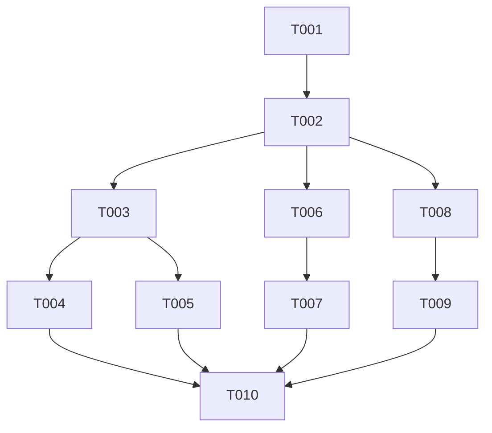

# Tasks: Sidecar Data Model Alignment

**Feature**: [Sidecar Data Model Alignment](./spec.md)
**Plan**: [Implementation Plan](./plan.md)

## Phase 1: Setup

- [x] T001 Verify project structure and active branch `017-sidecar-model-alignment`

## Phase 2: Foundational

- [x] T002 Update `ActiveIntentsFile` interface in `src/services/orchestration/OrchestrationService.ts` (line 10) to support both `active_intents` and `intents` keys

## Phase 3: User Story 1 - Initial Sidecar State (P1)

**Story Goal**: Ensure `intent_map.md` and `active_intents.yaml` are correctly initialized with documented architectural defaults.

**Independent Test Criteria**:

- Delete `.orchestration/` directory.
- Call `initializeOrchestration()`.
- Check `.orchestration/intent_map.md` contains the canonical header and placeholder text.
- Check `.orchestration/active_intents.yaml` uses the `active_intents:` root key.

**Implementation Tasks**:

- [ ] T003 [P] [US1] Create unit tests for sidecar initialization in `src/services/orchestration/__tests__/OrchestrationService.test.ts`
- [x] T004 [US1] Update `intent_map.md` template in `OrchestrationService.initializeOrchestration()` (lines 258-265) in `src/services/orchestration/OrchestrationService.ts`
- [x] T005 [US1] Update active_intents.yaml initial template to use canonical `active_intents:` root key in OrchestrationService.initializeOrchestration() (line 243) in src/services/orchestration/OrchestrationService.ts

## Phase 4: User Story 2 - Canonical Data Format (P1)

**Story Goal**: All saved intents must follow the canonical `active_intents:` root key documented in the architecture specification.

**Independent Test Criteria**:

- Write a list of intents using `saveIntents()`.
- Verify the saved YAML file has the root key `active_intents:`.

**Implementation Tasks**:

- [x] T006 [P] [US2] Add unit tests for canonical saving in `src/services/orchestration/__tests__/OrchestrationService.test.ts`
- [x] T007 [US2] Update OrchestrationService.saveIntents() (line 529) to write the canonical `active_intents:` root key in src/services/orchestration/OrchestrationService.ts

## Phase 5: User Story 3 - Graceful Migration (P2)

**Story Goal**: The system must accept the legacy `intents:` key for backward compatibility while prioritizing the canonical `active_intents:` key if both are present.

**Independent Test Criteria**:

- Load an `active_intents.yaml` with only a legacy `intents:` key and verify it parses correctly.
- Load an `active_intents.yaml` with both keys and verify that the data from `active_intents:` is returned.

**Implementation Tasks**:

- [x] T008 [P] [US3] Add unit tests for legacy fallback and precedence in `src/services/orchestration/__tests__/OrchestrationService.test.ts`
- [x] T009 [US3] Refactor `OrchestrationService.getActiveIntents()` (line 110) to implement precedence-based parsing in `src/services/orchestration/OrchestrationService.ts`

## Phase 6: Polish & Cross-Cutting Concerns

- [x] T010 Final verification: Run all tests in `src/services/orchestration/__tests__/OrchestrationService.test.ts` and verify success criteria SC-001 to SC-004 are met.

## Dependency Graph

## Parallel Execution Examples

### Parallel US1 & US2 Tasks

- T003 (Initialization tests) and T006 (Saving tests) can be developed in parallel as they target different logic paths.

### Parallel US3 Tasks

- T008 (Migration tests) can be developed in parallel with US1/US2 implementations as long as the interface change in T002 is complete.

## Implementation Strategy

1. **Foundational (T002)**: Update the interface first to avoid type errors across all subsequent tasks.
2. **MVP (US1 & US2)**: Focus on canonical initialization and saving to ensure new workspaces are compliant.
3. **Compatibility (US3)**: Add the migration layer to support existing users.
4. **Validation (Phase 6)**: Final holistic verification.
